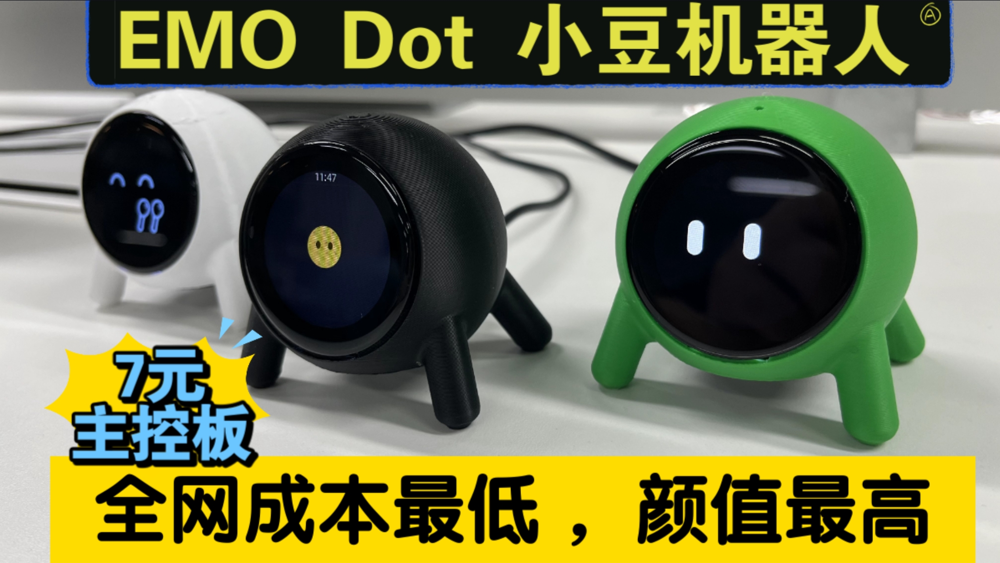

# EMO Dot 1.28(小豆AI表情机器人)
## 项目简介

EMO Dot 1.28(小豆)，采用7块2的ESP32 C3 Supermini开发板，高颜值玻璃盖板屏幕，3D打印外壳，具有表情显示，AI语音对话，英文学习等功能，角色及音色均可在小智AI后台配置。

**2023年3月8日更新：**

    为了解决带盖板屏幕缺货问题，我重新设计了一版小豆机器人结构，采用市面上常见的1.28不带盖板屏幕，这样物料成本更低，也更容易采购，降低大家的复刻难度。
**MakerWorld模型链接：**[新版无需屏幕盖板的EMO Dot-小豆机器人](https://makerworld.com.cn/zh/models/1010915-wu-xu-ping-mu-gai-ban-de-emo-dot-xiao-dou-ji-qi-re)

## 项目特色
* 总成本低于50元（C3版本）

* 高颜值玻璃盖板

* 在ESP32S3 N4R2的极低内存和Flash中，实现了语音唤醒及对话功能

* 卡扣设计，无螺丝，组装复刻均很简单

* 角色及音色均可在小智AI后台配置

* 声纹识别


## 项目硬件


### C3版本
| 型号 | 描述 | 链接 |价格 |
| ---- | ---- | ---- | ---- |
| ESP32 supermini C3 | C3开发板 | [淘宝链接](https://item.taobao.com/item.htm?id=748324039194) | 7.2|
| 1.28LCD | 带玻璃盖板 | [淘宝链接](https://item.taobao.com/item.htm?&id=694336841904) | 20|
| 1.28 lcd&Audio扩展板 | 屏幕背板及音频PCB | [立创开源]( https://oshwhub.com/xglaaa/emodot-xiaodou) | 17|
| 喇叭 | 2415 | [淘宝链接](https://item.taobao.com/item.htm?id=728806967199) | 2.1|
| 麦克风 | 4015 | [淘宝链接](https://item.taobao.com/item.htm?id=764128372417) | 0.28|
| mx1.25转杜邦线8pin | 两根 | [淘宝链接](https://item.taobao.com/item.htm?id=743491497341) | 2|
| 合计 |-|-| 48.58 |

#### 备注
    目前带玻璃盖板屏幕缺货中，价格可能有浮动，但是颜值没的说。

    后续会尝试出一个没有玻璃盖板的方案，敬请期待。
    
    2023年3月8日更新：

    为了解决带盖板屏幕缺货问题，我重新设计了一版小豆机器人结构，采用市面上常见的1.28不带盖板屏幕，这样物料成本更低，也更容易采购，降低大家的复刻难度。
    
### S3版本
| 型号 | 描述 | 链接 |价格 |
| ---- | ---- | ---- | ---- |
| ESP32 supermini S3 | S3开发板 | [淘宝链接](https://item.taobao.com/item.htm?id=777200828819) |20.4 |

### 版本区别
C3版本无语音唤醒，必须触摸小豆机器人头顶触摸区域才能唤醒交互。机器人唤醒开始聆听对话后，无需再次触摸交互。

#### 注意事项
    部分ESP32 supermini C3开发板天线设计有缺陷，必须在menuconfig配置降低WIFI发射功率。

### 结构外壳
本项目结构参考了国外网友及MoveCall的MOJI设计。

由本人花了一天多的时间从零学习solidworks设计完成，因长时间以错误姿势画图，还导致了严重的手肘关节疼痛，一周多时间才恢复。

外壳使用拓竹P1SC打印机打印，去年双十一3400购入，真香！

MakerWorld模型链接：[EMO Dot 小豆表情机器人](https://makerworld.com.cn/zh/models/1003119-emo-dot-xiao-dou-biao-qing-ji-qi-ren)

MakerWorld模型链接：[新版无需屏幕盖板的EMO Dot-小豆机器人](https://makerworld.com.cn/zh/models/1010915-wu-xu-ping-mu-gai-ban-de-emo-dot-xiao-dou-ji-qi-re)

## 固件烧录与编译
### 固件烧录
项目基于xiaozhi-esp32, 新手建议先不要搭建开发环境，直接使用免开发环境烧录的固件。

| 文件名 | 下载链接 | 备注 |
| ------ | -------- | -------- |
| Supermini C3版固件 | [下载](bin/EMO-Dot-C3-1.28-1.4.1_20250305.bin) |屏幕背光低电平有效|
| Supermini S3版固件 | [下载](bin/EMO-Dot-C3-1.28-1.4.1_20250305.bin) |屏幕背光低电平有效|

### 固件编译
开源代码见我fork的[xiaozhi-esp32](https://github.com/M-D-777/xiaozhi-esp32)，如有需要可按照xiaozhi-esp32文档自行编译烧写。

后续我也会向xiaozhi-esp32官方仓库提交pull requeset，希望虾哥能审核通过。
#### 编译注意事项
    因Supermini C3和S3的flash均只有4MB，所有相关flash需重新配置，同时S3还需注意PSRAM和LOG等级。

#### C3版本编译
[C3 版本menuconfig注意事项](https://github.com/M-D-777/xiaozhi-esp32/blob/emo-dot/main/boards/emo-dot-c3-1.28/README.md)
#### S3版本编译
[S3 版本menuconfig注意事项](https://github.com/M-D-777/xiaozhi-esp32/blob/emo-dot/main/boards/emo-dot-s3-1.28/README.md)

## 硬件连线
### C3版本
[emo-dot-c3-1.28 conifg](https://github.com/M-D-777/xiaozhi-esp32/blob/emo-dot/main/boards/emo-dot-c3-1.28/config.h)
``` 
#define AUDIO_I2S_GPIO_MCLK GPIO_NUM_NC
#define AUDIO_I2S_GPIO_WS   GPIO_NUM_10
#define AUDIO_I2S_GPIO_BCLK GPIO_NUM_8
#define AUDIO_I2S_GPIO_DIN  GPIO_NUM_7
#define AUDIO_I2S_GPIO_DOUT GPIO_NUM_20

#define AUDIO_CODEC_PA_PIN       GPIO_NUM_21//GPIO_NUM_1
#define AUDIO_CODEC_I2C_SDA_PIN  GPIO_NUM_5
#define AUDIO_CODEC_I2C_SCL_PIN  GPIO_NUM_6

#define BOOT_BUTTON_GPIO        GPIO_NUM_9

#define DISPLAY_BACKLIGHT_PIN GPIO_NUM_0
#define DISPLAY_BACKLIGHT_OUTPUT_INVERT false //最新硬件已更新为高电平有效

#define DISPLAY_SPI_SCLK_PIN    GPIO_NUM_3
#define DISPLAY_SPI_MOSI_PIN    GPIO_NUM_4
#define DISPLAY_SPI_DC_PIN      GPIO_NUM_1
#define DISPLAY_SPI_CS_PIN      GPIO_NUM_2

```
### S3版本
[emo-dot-S3-1.28 conifg](https://github.com/M-D-777/xiaozhi-esp32/blob/emo-dot/main/boards/emo-dot-s3-1.28/config.h)
```
#define AUDIO_I2S_GPIO_MCLK GPIO_NUM_NC
#define AUDIO_I2S_GPIO_WS   GPIO_NUM_5
#define AUDIO_I2S_GPIO_BCLK GPIO_NUM_3
#define AUDIO_I2S_GPIO_DIN  GPIO_NUM_4
#define AUDIO_I2S_GPIO_DOUT GPIO_NUM_6

#define AUDIO_CODEC_PA_PIN       GPIO_NUM_7
#define AUDIO_CODEC_I2C_SDA_PIN  GPIO_NUM_2
#define AUDIO_CODEC_I2C_SCL_PIN  GPIO_NUM_1

#define BUILTIN_LED_GPIO        GPIO_NUM_48
#define BOOT_BUTTON_GPIO        GPIO_NUM_0

#define DISPLAY_BACKLIGHT_PIN GPIO_NUM_9
#define DISPLAY_BACKLIGHT_OUTPUT_INVERT false //最新硬件已更新为高电平有效

#define DISPLAY_SPI_SCLK_PIN    GPIO_NUM_12
#define DISPLAY_SPI_MOSI_PIN    GPIO_NUM_13
#define DISPLAY_SPI_DC_PIN      GPIO_NUM_10
#define DISPLAY_SPI_CS_PIN      GPIO_NUM_11
#define DISPLAY_SPI_RESET_PIN   GPIO_NUM_NC

```
## 后续规划
* 更多的表情

* 增加1.8寸屏及AMOLED等各种屏的适配支持

* 结构及PCB优化

* 扩展智能家居等功能

## 致谢
* 感谢虾哥开源的小智AI，让广大网友可以零门槛创造AI机器人

* 感谢热心网友 - 你要不要吃菠萝，设计的可爱表情包

* 感谢鱼鹰光电鱼总[淘宝链接](https://shop110742373.taobao.com/shop/view_shop.htm)及大众点屏社区广大网友支持

